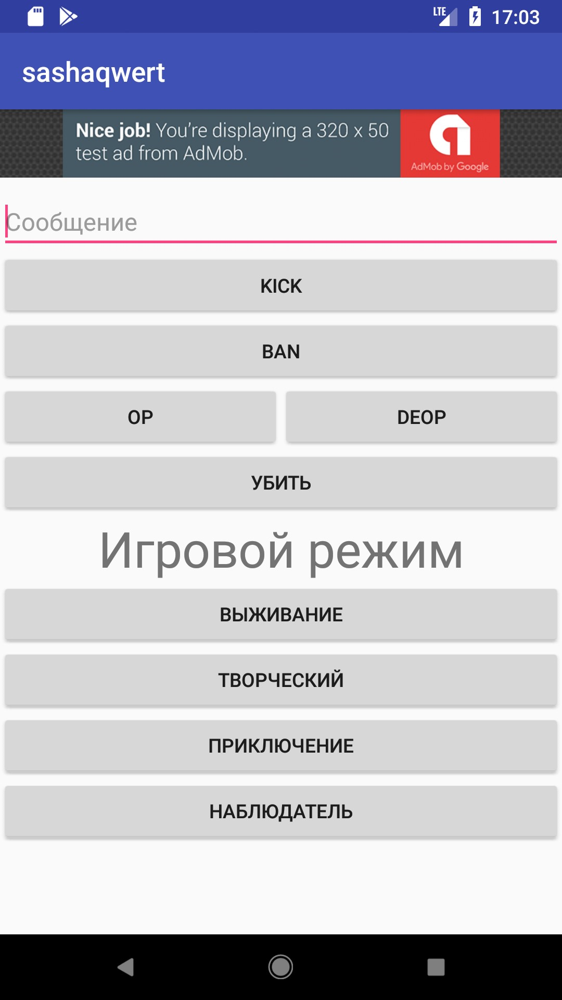

# ArenaControl

Приложение позволяет управлять серверами Minecraft, размещёнными на хостинге [MyArena.ru](https://www.myarena.ru/game_mc.html?idp=604611) (Ссылка реферальная).

Причиной для разработки данного приложения стала нехватка функционала официального приложения хостинга: меня интересовала возможность выполнять некоторые команды в один клик (кик, бан, изменение погоды, ...), но таких возможностей не было.

В процессе работы над этим проектом мне понадобился метод просмотра консоли сервера, но на тот момент он официально не предоставлялся. Я его получил через декомпиляцию существовавшего на тот момент официального приложения. Подробнее описано в проекте [ArenaConsole](https://github.com/ScCraftRU/ArenaConsole)

* [Сайт проекта](https://arenacontrol.sccraft.ru/)
* [Политика конфиденциальности](./privacy)

# Скриншоты

## Управление игроком

## Управление миром

## Консоль сервера

