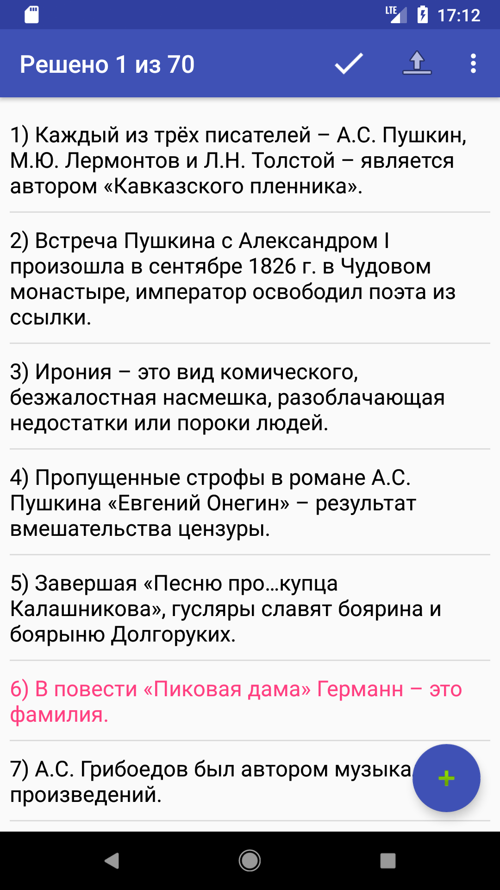
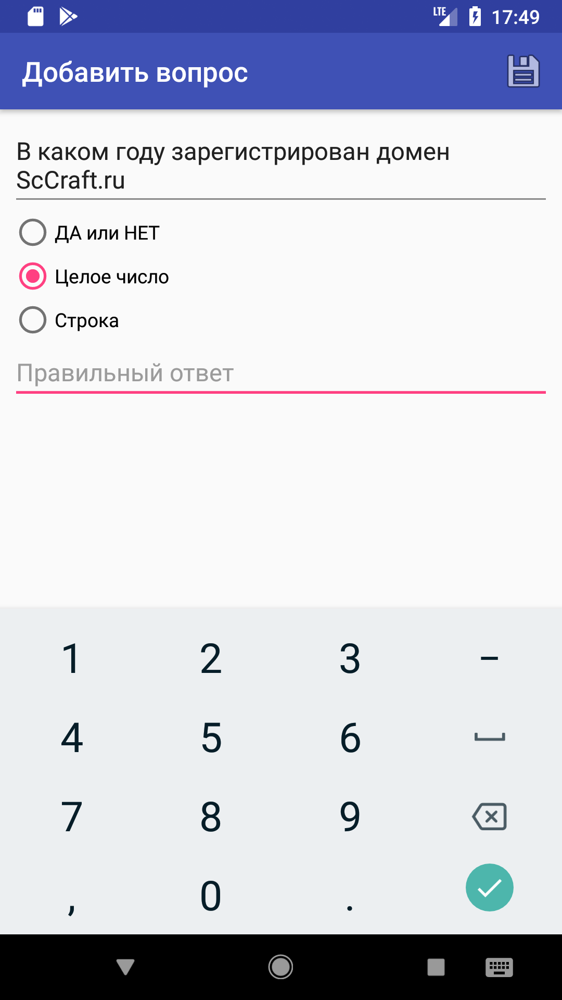
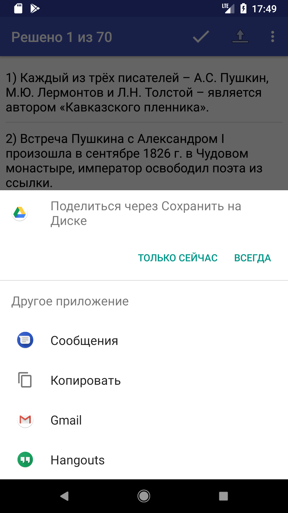

Чтобы создать свой сервер для ScAsk вам нужно следующее:

* Приложение ScAsk
* Свой Web-сайт с возможностью загрузки любых файлов.
* Компьютер (Лучше на Linux)

# Шаг 1. Создание вопросов.

Чтобы добавить вопрос, нажмите кнопку "+" в нижнем правом углу.

 
Скриншот главного экрана

 
   
 

Введите вопрос, выберете тип ответа и укажите ответ.

 
Экран добавления вопроса

 
  
 

Нажмите кнопку "Сохранить"

# Шаг 2. Экспорт JSON на ПК.

Нажмите кнопку экспорта в вверхней части экрана.

  
Выбор приложения для экспорта

   

Выберете способ отправки. (Рекоммендуется использовать KDE Connect)

# Шаг 3. Преобразование данных.

Создайте текстовый документ с расширением `.scask`

Запишите в него JSON вопроса. Каждый вопрос с новой строки!

Сохраните файл.

# Шаг 4. Загрузка на сервер.

Загрузите ранее сохранённый файл на ваш Web-сервер в каталог, доступный для GET-запросов.
